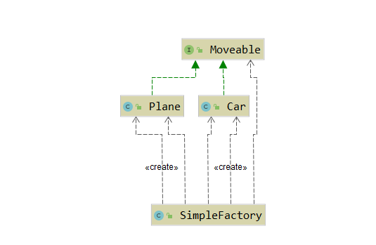
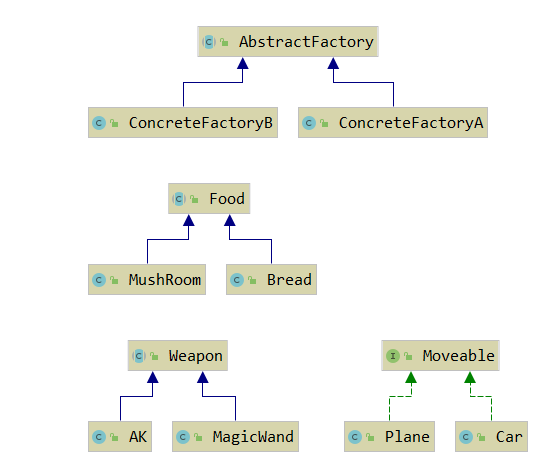
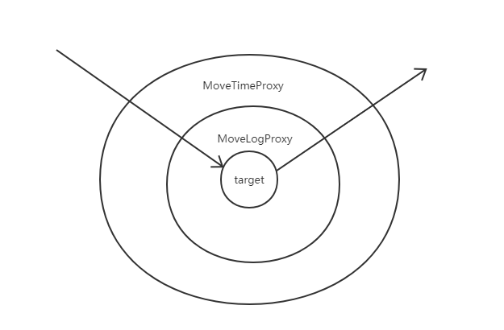
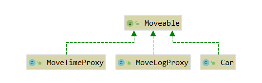
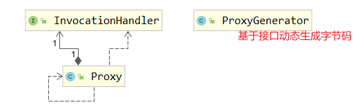
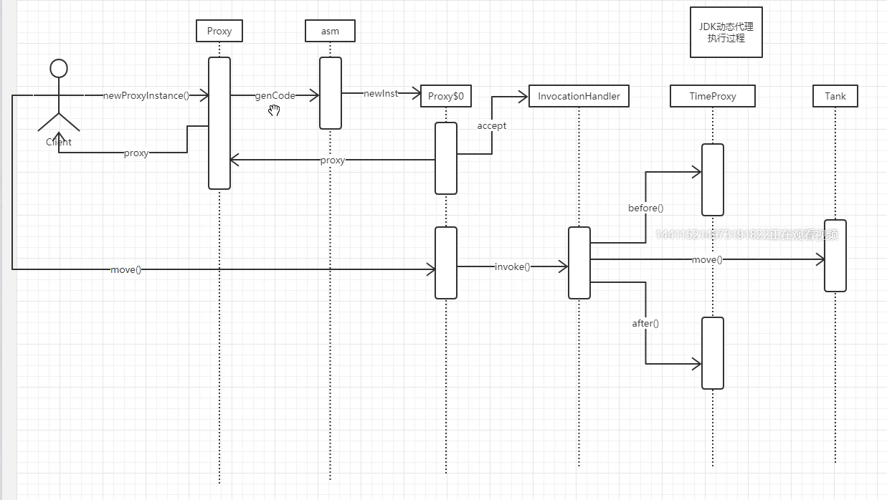
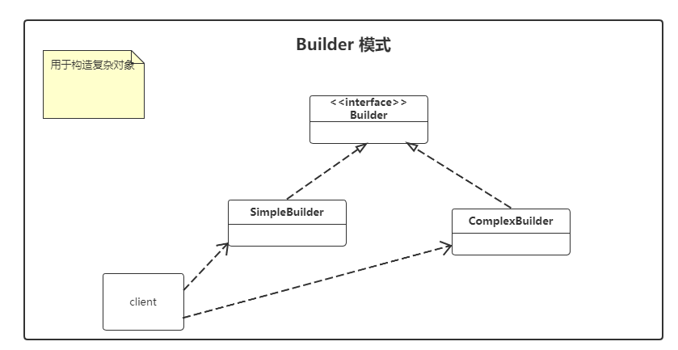
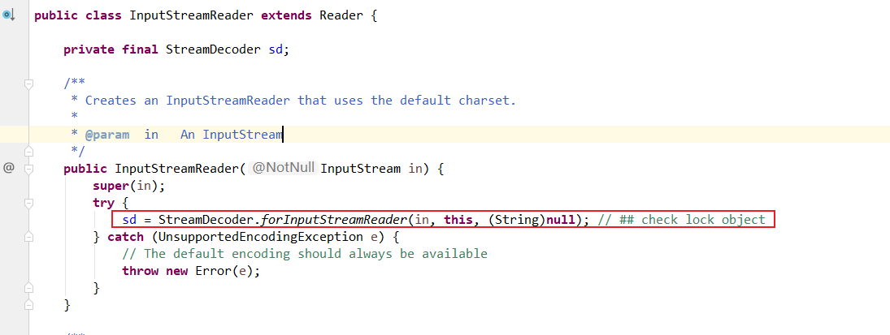
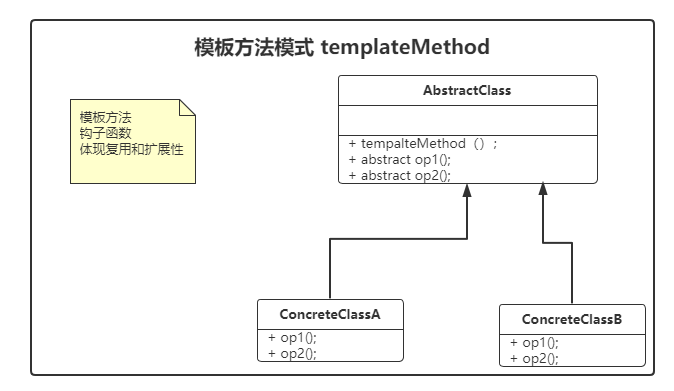

# 前言

​		总结一下设计模式， 虽然在工作中用到设计模式的机会不是很多， 但框架设计中有很多灵活的设计模式应用， 理解常见设计模式对于框架学习和源码阅读非常重要。 

​		**设计模式是对面向对象编程思想的灵活运用，  抽象， 模板，复用， 多态。 整体分为三类， 分别处理如何创建对象， 如何组织类， 如何处理对象行为。**

1. 创建型模式：如何创建对象
2. 结构型模式：如何组织对象
3. 行为型模式：处理对象行为

# 设计原则


# singleton 单例模式 

​	工作中如果需要使用到单例设计模式， 可以直接使用饿汉式或者静态内部类的写法， 没必要追求奇技淫巧， 工程学科以工程为主。

​	**注意事项:** 如果写的类需要被外部团队使用，也可以采用枚举形式， 反射可以绕过 private 关键字来实例化。枚举不支持反射，不支持clone，序列化与反序列化。 

​	

## 模式定义

​		保证在应用程序中只有一个实例，并提供全局唯一的访问点。 

## 应用

1. *Manager， *Factory，工具类。
2. Spring容器默认为singleton。

## 例子

### 饿汉式

```java
public class Singleton01 {

    // 线程安全, JVM保证, 一个class文件只被load一次, load一次, 初始化一次
    private static final Singleton01 INSTANCE = new Singleton01();

    // 1. 私有化构造器
    private Singleton01() {

    }

    // 2. 提供全局访问点
    public static Singleton01 getInstance() {
        return INSTANCE;
    }
}
```

### 懒汉式

```java
public class Singleton05 {
    private static volatile Singleton05 INSTANCE = null;
    private Singleton05() {}
    public static Singleton05 getInstance() {
        if (INSTANCE == null) {
            // 第一次判断， 高并发场景提升一定效率
            synchronized (Singleton05.class) {
                if (INSTANCE == null) {
                    INSTANCE = new Singleton05(); // 高并发下JIT编译的指令重排可能会导致获取到 INSTANCE = null 的情况
                }
            }
        }
        return INSTANCE;
    }
}
```

### 静态内部类

```java
/**
 * 静态内部类形式 （工作中可用）
 *  1. 实现了懒加载（jvm类加载和static初始化机制）
 *  2. 线程安全(类的加载有JVM保证线程安全）
 *
 * @author panxj
 */
public class Singleton06 {

    private Singleton06() {

    }

    private static class Singleton06Holder {
        public static final Singleton06 INSTANCE = new Singleton06();
    }

    public static Singleton06 getInstance() {
        return Singleton06Holder.INSTANCE;
    }
}
```

### 枚举类

```java
/**
 * 枚举定义单例模式
 * 1. 保证单例
 * 2. 防止反射
 *
 * @author panxj
 */
public enum Singleton07 {
    // ENUM  默认修饰符 public static final
    INSTANCE;
}
```

**枚举不支持反射，clone，序列化与反序列化， 反射源码， 当字节码文件是 `enum`修饰时，直接抛出了异常。** 


# strategy 策略模式 ☆ 

## 模式定义

​		定义一个算法组， 分别封装起来， 让它们之间可以相互替换， 策略模式独立于算法的使用者。 面向接口编程， 将算法定义为接口， java8 之后可以直接将算法定义为函数式接口， 需要不同算法的依赖，使用lambda表达式实现。 


## 应用

​		策略模式经常和工厂模式一起使用， 根据 client 状态，工厂动态实例化不同的策略实例。 


## 例子

### 促销打折策略


### 对象创建策略

spring instantiationstrategy 创建实例策略


OA系统审批流选择策略


# composite 组合模式 

​	处理树状结构的设计模式， 项目中如果需要处理树状结构的场景， 可以根据情况使用组合模式


## 例子

### 代码模拟Linux树状目录结构

代码参考 `com.xiaopantx.design.composite`包

```java
/**
 * @author panxj
 */
public class MainTest {

    public static void main(String[] args) {
        Node root = new BranchNode("/", "根目录",
                Arrays.asList(
                        new BranchNode("/etc", "配置文件目录",
                                Arrays.asList(
                                        new Leaf("/etc/profile", "系统环境配置文件"),
                                        new BranchNode("/etc/sysconfig", "系统配置目录", Collections.emptyList()))),
                        new BranchNode("/proc", "操作系统映射目录", Collections.emptyList()),
                        new BranchNode("/root", "系统用户根目录", Collections.emptyList())));

        tree(root,  0);

    }

    public static void tree(Node node, int depth) {
        for (int i = 0; i < depth; i++) {
            System.out.print("\t");
        }
        node.print();
        if (node instanceof BranchNode) { // 递归结束条件
            BranchNode branch = (BranchNode) node;
            List<Node> nodes = branch.getNodes();
            depth++;
            for (Node n : nodes) { // 递归体
                tree(n, depth);
            }
        }
    }
}
```


# flyweight 享元模式

​	重复利用对象， 共**享元**数据，经常和 composite （组合模式） 一起使用。 


## 应用

​		各种连接池， 线程池，共享对象的缓存优化。 

## 例子

### GOF 享元模式 - 字处理软件

​		字处理软件中经常需要用到一些小对象，例如我们键盘录入一个字符 A ， 从触发硬件中断到应用程序， 程序中会使用到相关的字符对象， 这些对象是可以复用的， 每次需要用到字符的时候， 直接从 **字符池**中获取。 

### 字符串常量池

```java
/**
         * jdk intern() 方法注释， 一个字符串值， 持有 class 相关的私有常量
         * A pool of strings, initially empty, is maintained privately by the
         * class {@code String}.
         *
         */
System.out.println(s1.intern() == s2); // true
System.out.println(s3.intern() == s4.intern()); // true
```

### IntegerCache


### ThreadPoolExecutor 线程池

### DataSource 数据源连接池


# Factory 工厂模式

​		任何可以产生对象的方法或者类， 都可以称为工厂， 1. 灵活控制生产过程 2. 权限，修饰，日志。

​		形容词的定义用接口， 名词的定义用抽象类。**在业务逻辑代码中，剥离对于具体对象的依赖关系。**

​		任意定制交通工具  -  抽象类、接口

- 简单工厂，静态工厂， 工厂方法：**任意定义产品过程 - 简单工厂 、 静态工厂、Builder模式配合**
- 抽象工厂：任意定制产品族 - 一系列 composite 对象的组合生产 
- SpringIOC：Spring框架核心原理 

## 简单工厂



## 抽象工厂




# Proxy 代理模式 ☆ 

​		不改变原有代码的前提下，灵活控制一个或多个或部分（指定一批类）的行为， 可以通过代理模式实现，工程项目中使用静态代理还是动态代理，根据业务实际情况定义（根据对项目的理解）。proxy模式非常重要， **必须要数量掌握的设计模式之一**。

​		理解代理模式的常用例子： **计算程序运行时间**。 

​		benchmark 基线测试： 性能测试。 

Privilege， Transaction 

- 静态代理： 和decoration 装饰模式很像。 多态抽象，多层代理， 代理类是具体的直接声明的。
- 动态代理： 静态代理的基础上增强， 代理类是运行过程中动态生成的。
  - JDK `java.lang.reflect`包中 Proxy实现
  - cglib 扩展扩展实现。 
- SpringAOP： 切点表达式 （模式匹配 ） + 动态搭理 

## 静态搭理

​		简单的对对象进行增强， 聚合（aggregation）方式实现， 面向接口， 功能性设计模式一种，类似于装饰器模式。面向接口， 可以嵌套。 





```java
public static void main(String[] args) {
        // target 被代理类
        Moveable target = new Car();

        // 代理类  代理类与被代理类实现共同接口
        Moveable proxy = new MoveTimeProxy(
                new MoveLogProxy(
                        target
                )
        );
        proxy.move();
    }
```

## 动态代理 ☆ 

### jdk动态代理 

​	jdk 动态代理必须**面向接口**，这是 Proxy内部决定的。 基于接口在内存中生成代理。



#### 执行过程

​		**依赖ASM （字节码操作类库）**， 在内存中创建代理类， 使用ASM之后Java才有一定的动态语言特性 。 

​		**动态语言：**执行过程中， 动态修改字节码内容。 反射只能读取一些字节码信息，但是没有能力修改字节码内容。



```java
public static void main(String[] args) {
        final Moveable car = new Car();
        // 保留在内存中生成的代理类
        System.getProperties().put("jdk.proxy.ProxyGenerator.saveGeneratedFiles", "true");

        Moveable proxy = ((Moveable) Proxy.newProxyInstance(
                car.getClass().getClassLoader(), // 代理类 与 被代理类使用相同的类加载器加载
                car.getClass().getInterfaces(),  // jdk 动态代理基于接口实现
                new InvocationHandler() { // 被代理类的方法调动处理 ☆
                    /**
                     *
                     * @param proxy 代理类， 慎用， stack over flow
                     * @param method 调用方法
                     * @param args 方法参数
                     * @return
                     * @throws Throwable
                     */
                    public Object invoke(Object proxy, Method method, Object[] args) throws Throwable {
                        System.out.println("before............");
                        Object retVal = method.invoke(car, args);
                        System.out.println("after............");
                        return retVal;
                    }
                }
        ));
        proxy.move();
    }
```


### cglib 动态代理

​		code generator lib 字节码生成库。 相比 jdk 反射生成代理类， 更简单。 依赖外部类库。cglib 是基于**被代理类**生成一个**子类**。 

```xml
<!-- https://mvnrepository.com/artifact/cglib/cglib -->
<!-- cglib 类库 -->
<dependency>
    <groupId>cglib</groupId>
    <artifactId>cglib</artifactId>
    <version>3.3.0</version>
</dependency>
```

```java
public static void main(String[] args) {
        //增强器
        Enhancer enhancer = new Enhancer();
        enhancer.setSuperclass(Car.class);
        enhancer.setCallback(new MethodInterceptor() {
            @Override
            public Object intercept(Object o, Method method,
                                    Object[] objects, MethodProxy methodProxy) throws Throwable {
                System.out.println("before...");
                Object retVal = methodProxy.invokeSuper(o, objects);
                System.out.println("after...");
                return retVal;
            }
        });

        Car c = ((Car) enhancer.create());
        c.move();
    }
```


### instrument 动态字节码

在class文件加载过程中， 可以拦截字节码，动态操作， 使用比较少见， jdk自带。 


## SpringAOP

​		IOC + AOP， bean工厂 + 灵活配置 + 动态行为拼接（织入）  => Spring在Java框架中一哥的地位。 

# Iterator 迭代器模式

​		容器和容器遍历。 


# Builder 建造模式

​	**构建复杂对象**， 创建型模式， 处理构造对象的过程，构造对象的**参数较多且需要自由组合时**，可以使用 Builder模式， 屏蔽创建对象的复杂度 。 

- 分离复杂对象的构建和表示。 
- 同样的构建过程可以创建不同的表示。
- 无须记忆， 自然使用。 
- SpringSecurity 权限扩展点。 



```java
public class Person {

    private String name;
    private int age;
    private Location loc;

    //构建器经常作为内部类存在
    public static class PersonBuilder{
        // 构建目标对象
        private Person person;
        // 链式API
        public PersonBuilder name(String name) {
            person.name = name;
            return this;
        }
        public PersonBuilder age(int age) {
            person.age = age;
            return this;
        }

        public PersonBuilder loc(Location loc) {
            person.loc = loc;
            return this;
        }
        // 返回目标对象
        public Person build() {
            return person;
        }
    }

}
```


# Adaptor 适配器模式

​		接口转换器。 wrapper，包装器， 主要用于统一类的访问方式。

**注意事项：** jdk， 框架源码 中经常见到 xxxAdaptor的类， 这些类不是适配器模式， 例如 `WindowAdaptor，KeyAdaptor` 只是一种方便的编程方式， 将多功能接口进行默认的空实现， 子类针对扩展点做具体实现。 

- 电压转接
- java.io： 转换流
- jdbc-odbc bridge： 微软 SQLServer 一般都是通过 odbc进行访问， 适配模式转换为 jdbc 访问接口， client 直接访问 jdbc 接口。 
- ASM transformer
- sl4j (门面) ， log4j，log4j2，logback




# ChainOfResponsibility 责任链模式


# Observer 观察者模式 ☆ 


# TemplateMethod 模板方法模式

​		**钩子函数**， **面向对象思想中， 类， 抽象类， 一般用来表达抽象，模板，复用的概念， 接口则表达规范，协议的概念。** 模板方法模式是符合自然思考方式的一种设计模式。 



## 例子

```java
public abstract class SuperClass {
    // 模板方法
    public void templateMethod() {
        this.op1();
        System.out.println("中间操作");
        this.op2();
    }
    // 抽象方法， 不确定部分推迟到子类实现
    public abstract void op1();
    public abstract void op2();

    public static void main(String[] args) {
        SuperClass obj1 = new SubClassA();
        obj1.templateMethod();  // jwt swing中 paint()调用过程和这个相同
        System.out.println("-----------------------------------");
        SuperClass obj2 = new SubClassB();
        obj2.templateMethod();
    }
}
```

### jwt 和 swing 组件中大量运用